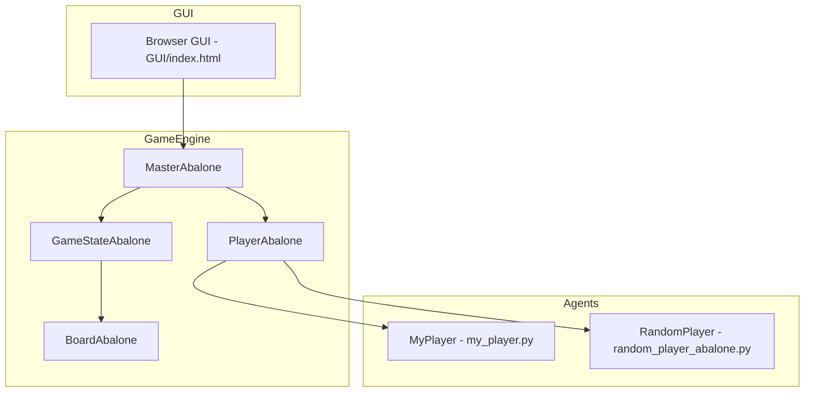

# Abalone Agent Project (Fall 2023)

<div align="center">


**Abalone — GUI & Game Engine provided, agent implemented by students**

_Board game simulation • Local & networked play • Minimax agent with heuristics and Zobrist hashing_

[🏃‍♂️ Quick Start](#-quick-start) • [Features](#features) • [Architecture Overview](#architecture-overview) • [Agent Details](#agent-details)

</div>

---

## Overview

This repository contains an Abalone game project used for the INF8175 course. The project provides a complete game engine and a browser-based GUI (already implemented). The student task for this project was to design and implement an AI agent that can play Abalone. The implemented agent lives in `my_player.py` and uses minimax with alpha–beta pruning, a transposition (Zobrist) table, and a set of board heuristics.

### What you get in this repo

- A working Abalone game engine: `board_abalone.py`, `game_state_abalone.py`, `master_abalone.py`, `player_abalone.py`.
- A browser UI in the `GUI/` folder (`index.html`, `main.js`, `main.css`) that can be used to visualize and interact with the game.
- The student agent implementation in `my_player.py` (authors: Émile Watier & Lana Pham).
- Utility players (example/random) such as `random_player_abalone.py` to test games.
- A runner script `main_abalone.py` which supports multiple execution modes: local, host/connect (networked), human-vs-computer, human-vs-human.

---

## Technology Stack

<div align="center">

### Core

<p>
	
	
	
</p>

### GUI

<p>
	
	
	
</p>

### Dev & Tools

<p>
	
	
</p>

</div>

---

## Architecture Overview

### System Architecture



### Data / Execution Flow (text)

1. `main_abalone.py` configures the initial board and players and starts `MasterAbalone`.
2. `MasterAbalone` drives the game loop, requests actions from players (proxies or local instances) and notifies listeners (GUI, recorders).
3. Player implementations (`MyPlayer`, `RandomPlayer`, `PlayerAbalone`) receive `GameStateAbalone` objects and must return a valid `Action`.
4. The GUI client (in `GUI/`) listens to game state updates and renders the board in the browser.

---

## Features

- Local play: run two local player implementations and let them play against each other.
- Human vs Computer: play locally against the implemented agent using the provided GUI.
- Networked play: host a game on one machine and connect from another using `host_game` / `connect` modes.
- Game recording: record game states to JSON with the `-r` flag.

---

## Agent Details

Short contract

- Inputs: `GameStateAbalone` (current board representation, turn, scores).
- Output: `seahorse.game.action.Action` (a legal move for the current player).
- Time limit: player receives a time limit configured when created (default 15 minutes in `main_abalone.py`).

Algorithm & design

- Search: Minimax with alpha–beta pruning (see `my_player.py` for `max_value` / `min_value`).
- Move ordering: actions are partially ordered using a delta-of-pieces heuristic to improve pruning.
- Transposition table: Zobrist-style hashing implemented in `TranspositionTable` (in `my_player.py`) to cache scored positions.
- Heuristics: combination of piece count difference, distance-to-center, pieces-together, and pieces-in-a-row.

Notable implementation details

- Cutoff depth is dynamic: small constant depth with an increase during very early steps.
- Zobrist keys are randomly initialized per agent instance (sufficient for a single run; deterministic seed can be added if reproducibility is needed).

Edge cases handled

- Terminal states: `is_done()` is checked before searching deeper.
- Transposition table is consulted to avoid recomputing positions already visited at equal or shallower depth.

Authors

- Émile Watier
- Lana Pham

---

## 🏃‍♂️ Quick Start (Windows PowerShell)

### Prerequisites

- Python 3.8+ (3.11+ recommended)
- Git (optional)

### Setup (PowerShell)

1. Clone or open this repository in your working directory.

2. Create and activate a virtual environment (PowerShell):

```powershell
python -m venv .\venv
.\venv\Scripts\Activate.ps1
pip install --upgrade pip
pip install -r requirements.txt
```

3. Run example commands from the repository root. Replace `python` with your python path if needed.

Run two local players (agent vs random):

```powershell
python .\main_abalone.py -t local .\my_player.py .\random_player_abalone.py
```

Run human vs computer (opens GUI locally for human controls):

```powershell
python .\main_abalone.py -t human_vs_computer .\my_player.py
```

Run human vs human (two GUI windows that can interact locally):

```powershell
python .\main_abalone.py -t human_vs_human
```

Host a networked game on machine A (provide local player file):

```powershell
python .\main_abalone.py -t host_game .\my_player.py -a 0.0.0.0 -p 16001
```

Connect from machine B to the hosted game (provide a player file to run locally):

```powershell
python .\main_abalone.py -t connect .\my_player.py -a <HOST_IP> -p 16001
```

Helpful flags

- `-g` / `--no-gui`: pass `-g` to disable the GUI (headless mode). Example: `-g` will set GUI to False.
- `-r`: record game states to a JSON file.
- `-c classic|alien`: select board start configuration (default: `classic`).
- `-l DEBUG|INFO`: set log level.

Notes about running

- The GUI files are static and located in `GUI/index.html`. When running with GUI enabled, the project will spawn the GUI client and it should connect automatically.
- If you run `host_game` and `connect` across machines, ensure the host machine's firewall allows the configured port (default 16001) and use the host's external IP for `-a`.

---

## Project Structure

```
INF8175-Projet/
├── board_abalone.py            # Board representation and helpers
├── game_state_abalone.py       # GameState wrapper used by Master & players
├── main_abalone.py             # Runner script (modes: local, host_game, connect, human_vs_computer, human_vs_human)
├── master_abalone.py           # Game master: game loop + listeners
├── my_player.py                # STUDENT AGENT: Minimax + heuristics + transposition table
├── player_abalone.py           # Base player class used by engine
├── random_player_abalone.py    # Example random player (for testing)
├── README.md                   # This file
├── requirements.txt            # Python dependencies
└── GUI/
		├── index.html              # Browser UI
		├── main.css                # GUI styles
		└── main.js                 # GUI client logic
```

---

## Development & Testing

- Run the local mode for quick automated matches between two players.
- To add a new player, implement a class `MyPlayer` inheriting from `PlayerAbalone` and expose it in a file. Example: `class MyPlayer(PlayerAbalone): ...`.
- Use `-r` to record games and inspect the generated JSON for debugging.

### Quick unit-style smoke test

Run a fast headless match (no GUI) between the agent and the random player:

```powershell
python .\main_abalone.py -t local .\my_player.py .\random_player_abalone.py -g
```

This runs two players locally without launching the GUI and is useful for quick automated testing.

---

## License & Academic Context

This repository contains an educational project developed for the INF8175 course. The agent implementation was written by the students listed in `my_player.py` header and is provided for academic purposes.

If you reuse or adapt the code for other purposes, please include attribution to the original authors.

---

<div align="center">

**Built with curiosity by Émile Watier & Lana Pham**

</div>
